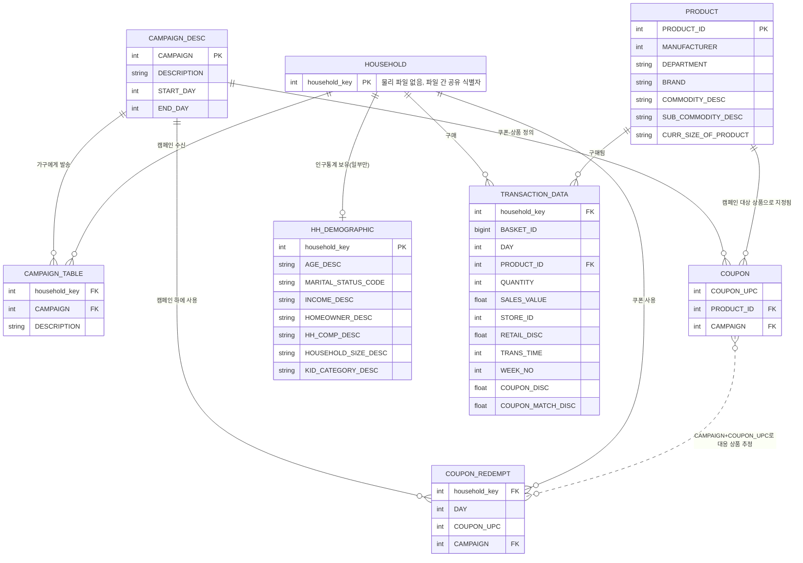

# 데이터 구조 점검과 ERD

`data/raw/` 원본 CSV 7개 파일을 직접 읽어(터미널 `wc -l`, `awk` 기반 열 이름·행 수·고유값 집계) 확인한 결과다. 이 문서는 구조 파악용이며 분석(처치/대조집단 구성, 성향점수, 효과 추정)은 아직 수행하지 않는다.

## 1. 파일별 행 수·열 이름

| 파일 | 데이터 행 수 | 열 수 | 열 이름 | 관측 단위 |
|---|---:|---:|---|---|
| `campaign_desc.csv` | 30 | 4 | `DESCRIPTION`, `CAMPAIGN`, `START_DAY`, `END_DAY` | 캠페인 |
| `campaign_table.csv` | 7,208 | 3 | `DESCRIPTION`, `household_key`, `CAMPAIGN` | 캠페인×수신 가구 |
| `coupon.csv` | 124,548 | 3 | `COUPON_UPC`, `PRODUCT_ID`, `CAMPAIGN` | 캠페인×쿠폰×대상 상품 |
| `coupon_redempt.csv` | 2,318 | 4 | `household_key`, `DAY`, `COUPON_UPC`, `CAMPAIGN` | 가구별 쿠폰 사용 이벤트 |
| `hh_demographic.csv` | 801 | 8 | `AGE_DESC`, `MARITAL_STATUS_CODE`, `INCOME_DESC`, `HOMEOWNER_DESC`, `HH_COMP_DESC`, `HOUSEHOLD_SIZE_DESC`, `KID_CATEGORY_DESC`, `household_key` | 가구 (인구통계 확보분만) |
| `product.csv` | 92,353 | 7 | `PRODUCT_ID`, `MANUFACTURER`, `DEPARTMENT`, `BRAND`, `COMMODITY_DESC`, `SUB_COMMODITY_DESC`, `CURR_SIZE_OF_PRODUCT` | 상품 |
| `transaction_data.csv` | 2,595,732 | 12 | `household_key`, `BASKET_ID`, `DAY`, `PRODUCT_ID`, `QUANTITY`, `SALES_VALUE`, `STORE_ID`, `RETAIL_DISC`, `TRANS_TIME`, `WEEK_NO`, `COUPON_DISC`, `COUPON_MATCH_DISC` | 장바구니 내 상품 거래행 |

행 수는 `wc -l`(헤더 제외)로 확인했고, `hh_demographic.csv`·`product.csv`·`campaign_desc.csv`는 행 수와 기본키 고유값 수가 일치해 행 중복이 없음을 확인했다.

## 2. 열별 자료형(추정)과 특이사항

| 파일 | 열 | 추정 자료형 | 비고 |
|---|---|---|---|
| `campaign_desc.csv` | `DESCRIPTION` | 범주형 문자열 | `TypeA`(5) / `TypeB`(19) / `TypeC`(6) |
| | `CAMPAIGN`, `START_DAY`, `END_DAY` | 정수 | `START_DAY` 최소 224, `END_DAY` 최대 719 (달력 날짜 아닌 상대 일자) |
| `campaign_table.csv` | `DESCRIPTION` | 범주형 문자열 | `campaign_desc.DESCRIPTION`과 동일 값 체계(중복 저장), `TypeA` 3,979 / `TypeB` 2,655 / `TypeC` 574행 |
| | `household_key`, `CAMPAIGN` | 정수 | 가구×캠페인 노출을 나타내는 브리지 행 |
| `coupon.csv` | `COUPON_UPC`, `PRODUCT_ID`, `CAMPAIGN` | 정수(int64) | `COUPON_UPC`는 UPC 코드지만 pandas 추론상 정수(선행 0 없음). 캠페인당 다수 상품에 매핑되는 다대다 구조 |
| `coupon_redempt.csv` | `household_key`, `DAY`, `COUPON_UPC`, `CAMPAIGN` | 정수(int64) | `DAY`는 실제 사용 시점(상대 일자) |
| `hh_demographic.csv` | `AGE_DESC`, `INCOME_DESC`, `HOMEOWNER_DESC`, `HH_COMP_DESC`, `HOUSEHOLD_SIZE_DESC`, `KID_CATEGORY_DESC` | 범주형 문자열(구간 표기) | 순서형이나 문자열로 저장 |
| | `MARITAL_STATUS_CODE` | 범주형 문자열 | 값 `A`(340) / `B`(117) / `U`(344, Unknown) — 결측 대신 Unknown 코드 사용 |
| | `household_key` | 정수 | |
| `product.csv` | `PRODUCT_ID`, `MANUFACTURER` | 정수 | `MANUFACTURER`는 제조사 코드(정수, 명칭 아님) |
| | `DEPARTMENT`, `BRAND`, `COMMODITY_DESC`, `SUB_COMMODITY_DESC`, `CURR_SIZE_OF_PRODUCT` | 문자열 | `DEPARTMENT` 44종, `BRAND`는 `National`/`Private`, `CURR_SIZE_OF_PRODUCT`는 공백 값 존재(결측성 확인 필요) |
| `transaction_data.csv` | `household_key`, `BASKET_ID`, `DAY`, `PRODUCT_ID`, `QUANTITY`, `STORE_ID`, `TRANS_TIME`, `WEEK_NO` | 정수 | `DAY` 범위 1~711, `WEEK_NO` 범위 1~102, `TRANS_TIME`은 HHMM 정수 표기 |
| | `SALES_VALUE`, `RETAIL_DISC`, `COUPON_DISC`, `COUPON_MATCH_DISC` | 실수 | 할인 계열 열은 음수 부호 관례 확인 필요(`DATA_DICTIONARY.md` 참고) |

## 3. 주요 연결 키와 고유값 수

| 파일 | 기본/주요 키 | 고유값 수 |
|---|---|---:|
| `campaign_desc.csv` | `CAMPAIGN` (PK) | 30 |
| `campaign_table.csv` | (`household_key`, `CAMPAIGN`) | household_key 1,584종 / CAMPAIGN 30종 |
| `coupon.csv` | (`CAMPAIGN`, `COUPON_UPC`, `PRODUCT_ID`) | CAMPAIGN 30종 / COUPON_UPC 1,135종 / PRODUCT_ID 44,133종 |
| `coupon_redempt.csv` | (`household_key`, `CAMPAIGN`, `COUPON_UPC`, `DAY`) | household_key 434종 / CAMPAIGN 30종 |
| `hh_demographic.csv` | `household_key` (PK) | 801 |
| `product.csv` | `PRODUCT_ID` (PK) | 92,353 |
| `transaction_data.csv` | 없음(행 자체가 관측 단위) | household_key 2,500종 / PRODUCT_ID 92,339종 / BASKET_ID 276,484종 |

**가구 모집단 크기가 파일마다 다르다는 점이 중요하다.**

- `hh_demographic.csv` 801개: 인구통계가 확보된 가구만
- `campaign_table.csv` 1,584개: 캠페인을 1회 이상 받은 가구
- `coupon_redempt.csv` 434개: 쿠폰을 1회 이상 사용한 가구
- `transaction_data.csv` 2,500개: 거래 기록이 있는 전체 가구(가장 넓은 모집단)

즉 `household_key`를 primary key로 갖는 별도의 "가구 마스터" 파일은 없다. `household_key`는 여러 파일에 걸쳐 나타나는 식별자이며, 인구통계·캠페인 수신·쿠폰 사용 여부에 따라 커버리지가 다르다. 처치/대조집단을 구성할 때 어떤 가구 모집단을 기준으로 할지 결정이 필요하다(현재는 구조 확인 단계이며 결정하지 않음).

## 4. ERD



## 5. 테이블 간 연결 관계 요약

- **캠페인 중심**: `campaign_desc.CAMPAIGN`(1)이 `campaign_table`(수신 가구), `coupon`(대상 상품), `coupon_redempt`(사용 이력) 세 파일에 각각 1:N으로 연결된다. 네 파일 모두 `CAMPAIGN` 고유값이 30개로 일치해 캠페인 범위는 일관된다.
- **가구 중심**: `household_key`가 `campaign_table`(수신), `coupon_redempt`(쿠폰 사용), `transaction_data`(구매), `hh_demographic`(인구통계)를 잇는 공통 식별자다. 단, 위에서 정리한 대로 파일마다 커버되는 가구 수가 다르다(801 / 1,584 / 434 / 2,500).
- **상품 중심**: `product.PRODUCT_ID`(1)가 `coupon`(캠페인 대상 상품 지정)과 `transaction_data`(실제 구매)에 1:N으로 연결된다. `coupon.csv`에는 44,133개 상품이 등장(전체 상품 92,353개의 약 48%)해, 캠페인이 다수 상품을 광범위하게 타겟팅하는 구조임을 보여준다.
- **쿠폰 정의 ↔ 쿠폰 사용**: `coupon.csv`(캠페인×쿠폰UPC×대상상품 정의)와 `coupon_redempt.csv`(가구×캠페인×쿠폰UPC 실제 사용)는 `CAMPAIGN`+`COUPON_UPC` 조합으로 대응되며, 이 조합을 통해 "어떤 가구가 어떤 상품을 겨냥한 쿠폰을 사용했는지" 추정할 수 있다. 단, `COUPON_UPC` 하나가 `coupon.csv`에서 여러 `PRODUCT_ID`에 매핑될 수 있어(1,135개 UPC가 44,133개 상품에 대응) 완전한 1:1 대응은 아니다.
- **거래 grain**: `transaction_data.csv`는 별도의 기본키가 없고, 한 행이 "특정 날짜(`DAY`)에 특정 가구가 특정 장바구니(`BASKET_ID`)에서 특정 상품(`PRODUCT_ID`)을 구매한 사건"을 나타낸다. `BASKET_ID`는 거래행과 별도의 장바구니(쇼핑 트립) 엔티티이지만, 이를 위한 별도 마스터 파일은 없다.

## 6. 확인한 사실만 정리 (해석·분석 미수행)

- 모든 파일은 헤더 1행 + 데이터 행으로 구성되며, pandas `isna()` 기준 7개 파일 전체에서 결측(NaN)이 0건이다. 결측은 별도 NA 마커 대신 `Unknown`(예: `MARITAL_STATUS_CODE`, `HOMEOWNER_DESC`)류 범주 코드로 표기되는 방식이다.
- `campaign_desc.csv`, `campaign_table.csv`, `coupon.csv`, `coupon_redempt.csv` 네 파일 모두 `CAMPAIGN` 고유값이 30개로 동일해 캠페인 식별자 범위는 정합적이다.
- `household_key`, `PRODUCT_ID` 등 식별자의 실제 데이터 범위와 커버리지는 파일마다 다르므로, 이후 처치/대조집단 구성이나 매칭 코드를 작성하기 전에 각 단계에서 어떤 가구 모집단을 사용하는지 명시가 필요하다(`CLAUDE.md` 데이터 보존 규칙 참고).
- 열 자료형은 `wc -l`/`awk` 1차 확인 후 `.venv`의 pandas `read_csv` 기본 추론으로 재검증했다. 1차 추정과 달리 `COUPON_UPC`는 `coupon.csv`·`coupon_redempt.csv` 모두에서 정수(int64)로 해석되며(선행 0 없음), 그 외 자료형 추정은 위 표와 일치했다.

## 7. 실행 환경

프로젝트 루트에 `.venv` 가상환경을 구성하고 `requirements.txt`를 설치해 확인했다.

```bash
python -m venv .venv
./.venv/Scripts/python.exe -m pip install -r requirements.txt
```

설치 확인 버전: pandas 2.3.3, numpy 2.5.2, scikit-learn 1.9.0, scipy 1.18.0, statsmodels 0.14.6, matplotlib 3.11.1, seaborn 0.13.2, plotly 6.9.0, streamlit 1.61.1, Jinja2 3.1.6 (모두 `requirements.txt` 버전 제약 범위 내).

---
*생성 방식: `data/raw/*.csv`를 `wc -l`·`awk`로 1차 스캔(행 수·열 이름·고유값 수) 후, `.venv` 가상환경의 pandas `read_csv`로 dtype과 결측치를 재검증함.*
